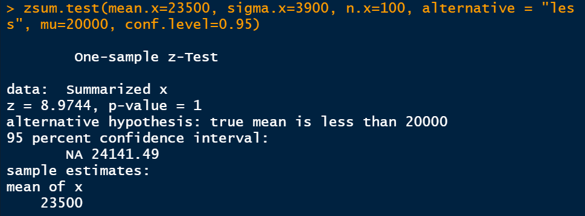

# P2_Probstat_E_5025201227

Bimantara Tito Wahyudi  <-->  5025201227


## Soal 1

### 1.a

#### Source Code
```r
x <- c(78, 75, 67, 77, 70, 72, 78, 74, 77)
y <- c(100, 95, 70, 90, 90, 90, 89, 90, 100)
diff <- y-x
sdev <- sd(diff)
sdev
```

#### Hasil


### 1.b

#### Source Code
```r
n <- 9
t <- mean(diff)/(sdev/sqrt(n))
pval <- pt(t, n-1,lower.tail = TRUE) # left tailed
pval
```

#### Hasil


### 1.c

#### Penjelasan

Pada poin 1.b didapat p-value sebesar 0,99997. Karena menggunakan left tail, maka H0 ≤ 0,05 dan H1 > 0,05 sehingga dapat ditarik kesimpulan bahwa H0 ditolak.

## Soal 2

#### Source Code
```r
zsum.test(mean.x=23500, sigma.x=3900, n.x=100, alternative = "less", mu=20000, conf.level=0.95)
```

#### Hasil


### 2.a

#### Penjelasan

Setuju, karena sampel menunjukkan rata-rata yang lebih dari 20.000 km.

### 2.b

#### Penjelasan

Pada output yang dihasilkan, didapat informasi bahwa H0 ditolak dengan persentase kepercayaan 95%

### 2.c

#### Penjelasan

P-value bernilai 1 (sangat besar) yang berarti H0 ditolak yang berarti mobil dikemudikan rata-rata lebih dari 20.000 km per tahun

## Soal 3

### 3.a

#### Penjelasan

H0 -> mu1 ≤ mu2

H1 -> mu1 < mu2

### 3.b

#### Source Code
```r
tsum.test(mean.x = 3.64, s.x = 1.67, n.x = 19, mean.y = 2.79, s.y = 1.32, n.y = 27, alternative = "less", conf.level = 0.95)
```

#### Hasil


### 3.c

#### Source Code
```r
z <- (3.64-2.79)/sqrt(1.67*1.67/19+1.32*1.32/27)
z
```

#### Hasil


### 3.d

#### Source Code
```r
qt(0.05, 2, lower.tail = TRUE)
```

#### Hasil


### 3.e

#### Penjelasan

Karena nilai kritikal lebih besar daripada p-value maka H0 tidak dapat ditolak

### 3.f

#### Penjelasan

Tidak terdapat perbedaan antara saham yang ada di Bali dan yang ada di Bandung apabila ditinjau dari uji statistik

## Soal 4

### 4.a

#### Source Code
```r
data <- read.delim("https://rstatisticsandresearch.weebly.com/uploads/1/0/2/6/1026585/onewayanova.txt")
set.seed(format(Sys.time(), "%H%M%S"))
dplyr::sample_n(data, 10)
ggboxplot(data, x = "Group", y = "Length",
          color = "Group", palette = c("#00AFBB", "#E7B800", "#FC4E07"),
          order = c("1", "2", "3"),
          ylab = "Length", xlab = "Grup")
```

#### Hasil


### 4.b

#### Source Code
```r
bartlett.test(Length ~ Group, data)
```

#### Hasil


### 4.c

#### Source Code
```r
model1 <- lm(formula = Group ~ Length, data)
model1
```

#### Hasil


### 4.d

#### Penjelasan

P-value yang didapat adalah 0.6400632. Asumsikan 𝛼 = 5%, maka H0 ditolak yang berarti terdapat perbedaan panjang antara ketiga spesies atau rata-rata panjangnya berbeda.

### 4.e

#### Penjelasan

Apabila menggunakan asumsi 𝛼 = 5%, maka perbedaan panjang kucing yang signifikan adalah grup 2 terhadap grup 1 dan 3.

### 4.f

#### Source Code
```r
ggplot(data) +
  geom_point(aes(x = Group , y = Length,
                 color = Group), size = 4) +
  
  ggtitle("Scatter Plot with feature differentiation - 1") +
  xlab("Length") +
  ylab("Group") +
  theme_bw() +
  theme(axis.text.x = element_text(face = 'bold.italic', 
                                   color = 'darkgreen',
                                   size = 10, angle = 0),
        axis.text.y = element_text(face = 'bold', 
                                   color = 'blue',
                                   size = 10, angle = 45))
```

#### Hasil


## Soal 5

### 5.a

#### Source Code
```r
GTL <- read_csv("https://drive.google.com/u/0/uc?id=1aLUOdw_LVJq6VQrQEkuQhZ8FW43FemTJ&export=download")
head(GTL)
str(GTL)
qplot(x = Temp, y = Light, geom = "point", data = GTL) + facet_grid(.~Glass, labeller = label_both)
```

#### Hasil


### 5.b

#### Source Code
```r
GTL$Glass <- as.factor(GTL$Glass)
GTL$Temp_Factor <- as.factor(GTL$Temp)
str(GTL)
anova <- aov(Light ~ Glass*Temp_Factor, data = GTL)
summary(anova)
```

#### Hasil


### 5.c

#### Source Code
```r
data_summary <- group_by(GTL, Glass, Temp) %>% summarise(mean=mean(Light), sd=sd(Light)) %>% arrange(desc(mean))
data_summary
```

#### Hasil


### 5.d

#### Source Code
```r
tukey <- TukeyHSD(anova)
tukey
```

#### Hasil


### 5.e

#### Source Code
```r
tukey.cld <- multcompLetters4(anova, tukey)
tukey.cld
cld <- as.data.frame.list(tukey.cld$`Glass:Temp_Factor`)
data_summary$Tukey <- cld$Letters
data_summary
```

#### Hasil

